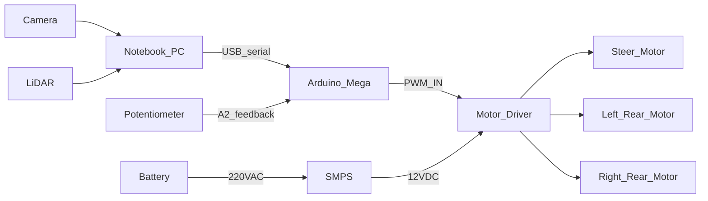

# 시스템 아키텍처

출처: PDF p.47–58

## 데이터/제어 흐름

| 구간 | 내용 |
|---|---|
| Camera ↔ PC | 영상 입력 |
| LiDAR ↔ PC | 각도별 거리 |
| PC ↔ Arduino | USB 시리얼로 속도·조향 명령 |
| Arduino ↔ 가변저항 | 현재 조향 피드백 (A2) |
| Arduino → 모터드라이버 → 모터 | PWM 제어 신호 → 전압 인가 |

## 전원

- 배터리 → (220V AC) → SMPS → 12V DC → 모터드라이버
- **조교 확인 전까지 배터리 OFF** (p.58)
