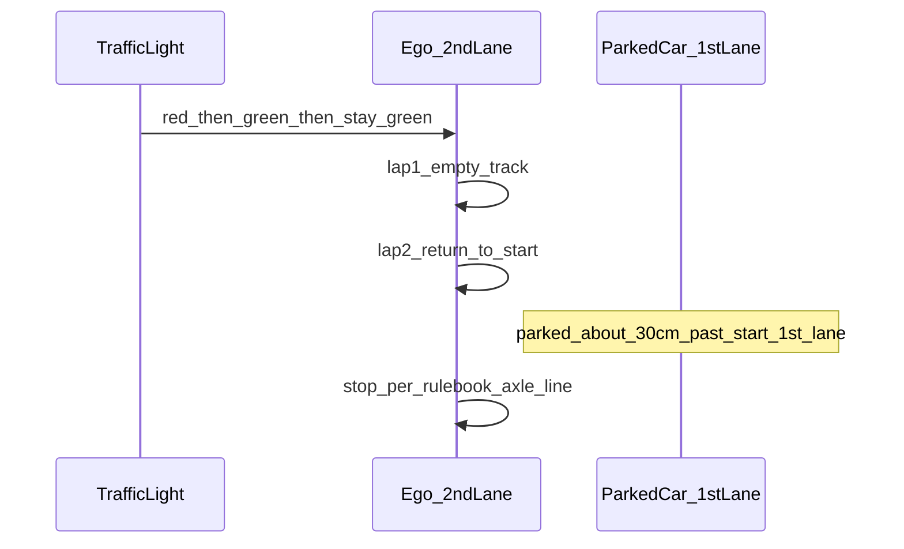

# 조교 구두 안내 (가규정)

상태: **가규정(조교 구두, 2026-08-12 · 추가확인 08-13 전)** · 내일 룰미팅 후 확정본으로 갱신  
규정집 ver3.3과 충돌 시 → **내일 확정본 우선** · 공식 조항은 [rules.md](rules.md) · [operations.md](operations.md)

## 미션 타임라인

| 단계 | 내용 |
|---|---|
| 대기 | 출발선 · **빨간불** · SW 실행·신호등 탐지 가능 |
| 출발 | **초록불**로 바뀌면 출발 |
| 1바퀴 | **장애물 전혀 없음** · **2차로** · 반시계 1랩 |
| 2바퀴 | 출발점으로 복귀 · (신호등이 빨간으로 바뀔 **가능성** → 내일 확인) |
| 도착 장면 | 출발점을 지나 **약 30cm 앞**부터 **1차로에 차량 1대** 정차 |
| 종료 정지 | **물체 탐지 후 정지**가 정서(정석). 채점 위치는 **규정집** 기준. 위치만 맞으면 수단은 자유 |

## 정지 채점 (규정집 우선 — 확정)

정지 **위치·실패(a3/a4) 채점**은 구두보다 **규정집 ver3.3이 정확**하다.

| 항목 | 기준 | 출처 |
|---|---|---|
| 정지 위치 | 앞바퀴 = 신호등 정지선 **앞쪽**, 뒷바퀴 = 같은 선 **뒤쪽** | [operations.md](operations.md) |
| 위치 실패 | 정지는 했으나 부정확 · 장애물까지 ≤1m → **a4(+10s)**, >1m → **a3(+50s)** | [penalties.md](penalties.md) |
| 미정지·충돌 | **a3(+50s)** | 규정집 |
| 수단 | LiDAR / YOLO 차량 / 정지선 / 장면 등 **자유** · 위치만 맞으면 됨 | 조교 구두 |

초기 구두의 “차축 사이 중앙에 출발선”은 **비공식 설명**으로만 두고, 개발·채점 목표는 규정집 정지선 정의로 맞춘다.

## 도착 장애물

- **정석:** 물체(1차로 정차 차량) 탐지 후 정지
- 설치: 출발점을 지나 **약 30cm 앞**부터 1차로에 **1대**
- 1랩에는 이 차량(장애물) **없음** — 랩2 복귀 시에만 등장하는 장면으로 설계할 것

## 정지 수단 · FOV

수단은 자유이나 FOV 한계는 동일:

- 최종 정지 위치 근처에서 1차로 차량·정지선이 **카메라 밖으로 사라질 수 있음**
- **조기 관측 + LiDAR/지연으로 마무리** → [mission-strategy.md](mission-strategy.md)

## 신호등

| 시점 | 예상 (가규정) | 비고 |
|---|---|---|
| 대기 | 빨간불 | |
| 출발 | 초록으로 전환 | 이후 **랩 중에는 초록 유지**가 기본 안내 |
| 랩1 주행 중 | 초록 유지 | 색 변화로 랩을 세지 말 것 |
| 랩2 / 도착 | 초록 유지 **또는 빨간으로 변할 수도** | **내일 룰미팅·트랙에서 반드시 확인** |

신호등 **정면 통과 횟수**는 여전히 랩 경계 후보이나, **색 변화(적↔녹)로 랩을 세는 전략은 위험**하다.  
랩2에서 갑자기 적이 되면 “재출발 대기”로 오인하지 않도록 상태머신에 주의.

## 채점 (구두 + 규정집)

- 페널티 = **시간 가산** · 순위 = 랩타임(+페널티) 짧은 순
- 차선 침범·이탈 모두 페널티 → 인지·제어 강건성 필수 ([penalties.md](penalties.md))

## 규정집 vs 구두 — 상태판

| 항목 | 채택 | 남은 확인 (룰미팅) |
|---|---|---|
| 정지 위치 · a3/a4 | **규정집** | — |
| 1랩 장애물 | **없음** (구두 확정) | — |
| 도착 장애물 | 출발점+약30cm · 1차로 1대 · 물체탐지 후 정지가 정석 | 정확한 설치 위치·크기 |
| 신호등 랩 중 | 초록 유지가 기본 | **랩2에 적으로 바뀌는지** |
| 수단 자유 | 위치만 맞으면 OK | — |

## 관련 문서

- [mission-strategy.md](mission-strategy.md) — 상태머신·정지 퓨전
- [logging-and-experiments.md](logging-and-experiments.md) — 내일 로깅·실험
- [dev-checklist.md](dev-checklist.md) — 검차·HW
