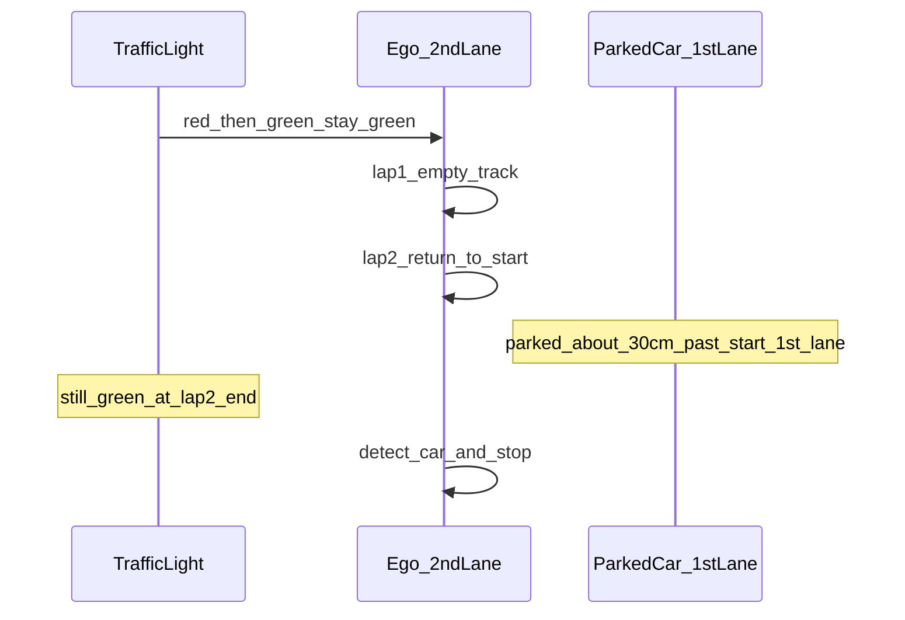

# 조교 구두 안내 (가규정)

상태: **가규정(조교 구두, 2026-08-12 · 추가확인 08-13)** · 룰미팅 확정본이 있으면 그쪽이 우선  
규정집 ver3.3과 충돌 시 → **확정본/규정집 우선** · 공식 조항은 [rules.md](rules.md) · [operations.md](operations.md)

## 미션 타임라인

| 단계 | 내용 |
|---|---|
| 대기 | 출발선 · **빨간불** · SW 실행·신호등 탐지 가능 |
| 출발 | **초록불**로 바뀌면 출발 |
| 1바퀴 | **장애물 전혀 없음** · **2차로** · 반시계 1랩 |
| 2바퀴 | 출발점으로 복귀 · 신호등은 **계속 초록** |
| 도착 장면 | 출발점을 지나 **약 30cm 앞**부터 **1차로에 차량 1대** 정차 |
| 종료 정지 | **출발선 앞 차량을 감지하고 정지** (물체 탐지 정석). 채점 위치는 **규정집**. 위치만 맞으면 수단 자유 |

## 정지 채점 (규정집 우선 — 확정)

| 항목 | 기준 | 출처 |
|---|---|---|
| 정지 위치 | 앞바퀴 = 신호등 정지선 **앞쪽**, 뒷바퀴 = 같은 선 **뒤쪽** | [operations.md](operations.md) |
| 위치 실패 | 정지는 했으나 부정확 · 장애물까지 ≤1m → **a4(+10s)**, >1m → **a3(+50s)** | [penalties.md](penalties.md) |
| 미정지·충돌 | **a3(+50s)** | 규정집 |
| 트리거 | 랩2 종료 시 **차량 감지 후 정지** (신호등 색 변화로 멈추지 않음) | 조교 구두 08-13 |
| 수단 | LiDAR / YOLO / 정지선 / 장면 등 **자유** | 조교 구두 |

## 도착 장애물

- **정석:** 출발선 앞 **1차로 정차 차량** 탐지 후 정지
- 설치: 출발점을 지나 **약 30cm 앞**부터 1차로에 **1대**
- 1랩에는 없음 · 랩2 복귀 시에만 등장

## 차선 페널티 (2차로 주행 · 구두 확정 08-13)

2차로 기준: **왼쪽 = 점선(IN)**, **오른쪽 = 실선(OUT)**

| 행위 | 왼쪽 점선 | 오른쪽 실선 |
|---|---|---|
| **밟기만** (접촉·침범) | **페널티 있음** (b3) | **페널티 없음** |
| **선을 넘어감** (이탈) | **페널티 있음** (b1) | **페널티 있음** (b1) |

개발 함의: 제어는 **왼쪽 점선 접촉을 특히 피할 것**. 오른쪽 실선은 살짝 밟는 정도는 허용되나, **밖으로 넘어가면** 이탈 페널티.

규정집 정의와 정합: 침범=점선 접촉, 이탈=실선·점선 넘어감 ([operations.md](operations.md) · [penalties.md](penalties.md)).

## 정지 수단 · FOV

- 최종 위치 근처에서 1차로 차량·정지선이 카메라 FOV 밖으로 사라질 수 있음
- **조기 관측 + LiDAR/지연 마무리** 또는 팀 논의 단순안:
  - **좌측(1차로) 차량 감지 AND 신호등 detection 박스 ≈ N픽셀** → 정지
  - 정지선 인식·신호등 **랩 카운트**보다 단순할 수 있음 (거리 프록시는 박스 크기)
- 상세·실험값: [mission-strategy.md](mission-strategy.md) «팀 논의안 — 단순 정지 휴리스틱»

## 신호등 (08-13 확정)

| 시점 | 상태 |
|---|---|
| 대기 | 빨간불 |
| 출발 | 초록 전환 |
| 랩1 · 랩2 · **종료 시점** | **계속 초록** (종료 시 적으로 바꾸지 않음) |

→ 종료 트리거는 **신호등 적불 아님**. **차량 감지**로 정지.  
랩 카운트는 색 변화가 아니라 정면 통과·거리·차량 등장 등으로.

## 채점

- 페널티 = 시간 가산 · 순위 = 랩타임(+페널티) 짧은 순
- 왼쪽 점선 침범·양쪽 이탈에 특히 주의

## 규정집 vs 구두 — 상태판

| 항목 | 채택 |
|---|---|
| 정지 위치 · a3/a4 | **규정집** |
| 1랩 장애물 | **없음** |
| 도착 | 출발점+약30cm · 1차로 1대 · **차량 감지 후 정지** |
| 신호등 | 출발 후·랩2 종료까지 **초록 유지** |
| 차선 | 좌 점선 **밟기=페널티** · 우 실선 **밟기=무페널티** · **어디든 넘어가면 페널티** |
| 수단 자유 | 위치만 맞으면 OK |

## 관련 문서

- [mission-strategy.md](mission-strategy.md)
- [logging-and-experiments.md](logging-and-experiments.md)
- [dev-checklist.md](dev-checklist.md)
